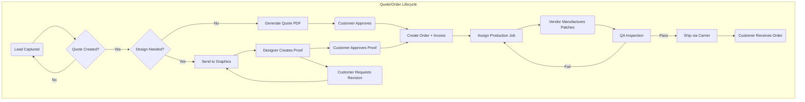
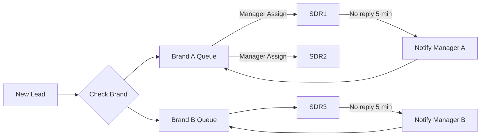

# Executive Summary  

Kamsoft Pakistan (with affiliated brands in the US, UK, AU, and NZ) currently runs a fragmented custom-patch business: leads pour in via web forms, calls (RingCentral), email, and chat, and everything is tracked in ad-hoc Google Sheets. Two sales teams compete on separate brand portfolios, while production, QA, and shipping are shared. This chaos leads to lost leads, slow responses, and errors. We propose a unified **Revenue & Fulfillment Operations Platform** to replace the mess with a single multi-brand system. 

Key features include a **Lead Management** module that ingests all channels into one dashboard and routes leads by brand/team (with SLA timers and manager escalation), a **CRM Shared Inbox** for email/chat/voice threads with attachments, a **Quote & Order Engine** with guided forms and versioned artwork proofs, and a **Vendor/Production Portal** with QA checklists, photo upload, and shipment tracking. The system will integrate with Stripe/PayPal/bank payments, RingCentral call APIs, and FedEx/DHL/UPS shipping APIs. Multi-currency support and role-based permissions ensure each brand’s data is separate but overseen by management. Dashboards for Sales (SDRs), Design, Production, QA, Admin, GM, and CEO will surface KPIs like leads, response times, conversion, revenue, delays, and refunds. 

In short, our solution centralizes order entry, quoting, approval, production, and fulfillment into a polished, keyboard-centric web app. It automates routine tasks (auto-email updates, shipment tracking, feedback solicitations) and provides full visibility to key roles. This blueprint details the required modules, workflows, data model, architecture options, and phased roadmap to build this final product (beyond any MVP), with references to industry best practices and integration APIs.  

## Business Context and Requirements  

- **Multi-Brand Operation:** Kamsoft is based in Pakistan but serves **US, UK, AU, NZ brands**. Each sales team owns specific brands (e.g. Team A: *theamericanpatch.com*, *patchmakers.ca*, *theeaglepatches.com*, *eaglepatches.uk*, *embroideredpatches.co.nz*). The platform must support **multiple “tenants” (brands)** in one app, isolating data by brand yet allowing consolidated metrics. Each brand may have different currency, shipping options, etc.  

- **Lead Intake & Channels:** Leads arrive via many channels: 
  - **Website forms** (custom quote requests) 
  - **Inbound calls** (number on Google Business and site, handled via RingCentral)
  - **Live chat widget** (Tawk.to on each site) 
  - **Email inquiries** (Gmail accounts) 
  - **Ads/Meta leads**.  
  These must all feed into a **central Lead Management queue**. Currently there is no system, so responses are slow and untracked. Best practice is to **automatically route leads to the right sales rep** based on rules (brand, source, performance)【20†L69-L78】【20†L141-L150】. SDRs must reply within minutes (or manager steps in). A clock/SLA timer will flag stale leads.  

- **Sales Team Structure:** There are **two rival sales teams**, each handling their brands. The **Sales Manager** for each team should get an overview and be able to reassign leads. SDR ownership persists after sale (SDR “owns” the account), but if an SDR is unavailable after 5 minutes, the lead is re-queued to the manager【20†L85-L94】. Leads should not sit unassigned.

- **Quotation Process:** Quotes are highly custom (“Every patch is unique”). There is no fixed pricing engine; prices are set **manually by staff**. The system must guide SDRs through all necessary fields: artwork specs (file upload, color count, special effects), patch specs (type, size, backing), and order details (quantity, turnaround, shipping destination). It should warn on “edge cases” (PVC+iron-on heat risk, leather+merrow invalid, oversize, etc.) as staff currently do verbally. Once specs are entered, the system will calculate a quote (based on dynamic price tables) and generate a PDF or email. Citing Stripe’s API, we can use **Stripe Quotes/Invoicing**: “A Quote is a way to model prices… Once accepted, it will automatically create an invoice”【38†L1-L4】. When a quote is accepted, the system converts it to an Order and issues an invoice (Stripe/PayPal integration).  

- **Artwork/Mockup Workflow:** The in-house (or freelance) designer creates a digital mockup based on customer art/idea. Clients often request revisions (sometimes dozens). The platform needs a **proofing workflow**: share PDFs/PNGs with clients, allow revisions, track versions and comments. Each revision round updates the ticket. Once approved, the design is locked and the order “Released to Production”. This mirrors **apparel ERP best practices**: customers receive digital proofs, approve or request changes, and time-stamped records keep disputes low【23†L151-L159】.

- **Production & Vendor Management:** After design sign-off and payment (full upfront), production orders are issued to external vendors (30+ global vendors, mostly in Karachi). Each vendor has known strengths (some excel at chenille, leather, woven, etc.). The system will include a **Vendor Portal** where production managers create purchase orders for vendors, showing only the necessary specs (design file, size, backing, etc., but not internal costs). Vendors should use a web/PWA interface (mobile-friendly, in English and Roman Urdu) to: view jobs, update status, ask questions, and upload photos of completed goods. Tracking vendor performance (on-time rate, defect rate) is crucial for future assignments. As noted by industry sources, a good portal includes **PO tracking and performance dashboards**【26†L414-L423】【26†L490-L498】.

- **Quality Assurance (QA):** When a vendor claims a job done, the patch units arrive for internal QA. The QA team uses a **digital inspection checklist** (mobile/web app) that requires specific checks (dimensions, color, seam quality, backing adherence) and **photos of each order’s samples**. Fail/pass must be recorded. We can draw on digital QC tools: for example, CheckProof’s mobile QC app lets teams “fill in required fields, and add image documentation—ensuring inspections are consistent”【29†L148-L157】; real-time photo evidence “makes reporting easier and supports clear communication”【29†L154-L163】. If an item fails, the ticket is sent back to vendor for reproduction, and vendor stats are updated. The original sales rep is notified so they can manage the client. Defects and rework become tracked “deviations” for continuous improvement【29†L162-L170】.

- **Shipping & Fulfillment:** Completed and QA-approved orders are shipped via FedEx (primarily), DHL, UPS, etc. Currently a person manually enters tracking and updates status. We will **automate shipping**: integrate carrier APIs or a multi-carrier service (e.g. EasyPost/Shippo) to create shipments and fetch tracking. For example, FedEx offers an “Advanced Integrated Visibility” API that delivers “near real-time tracking push notifications” via webhooks【31†L88-L92】. The system will record tracking numbers per order and automatically update shipment status. Instead of manual notifications, the status will show up on each order’s dashboard. (Future: automated emails to customers with tracking info.)  

- **Order Cloning & Repeat Sales:** Many customers reorder with minor changes. The system should allow one-click “Clone Order” to replicate specs (for example, same design, backing, new qty). Historical order data and file versions remain attached. This greatly speeds quoting repeat business. We will treat each new order as a separate ticket (with unique ID) but link it to the customer’s history for reference.  

- **Refunds & Escalations:** If an order is late, wrong, or unsatisfactory, customer service can issue refunds or replacements. The system will record escalation tickets. A simple rule: quality issues go through QA/vendor correction, shipment delays trigger logistic review, refund decisions come from Sales Manager/GM. Metrics on cancellations/refunds will be tracked as KPIs.

- **Multi-Currency:** Each brand may sell in a different currency (USD, CAD, GBP, NZD). The system will store currency at the order level. Integration with Stripe can handle multi-currency payments. We may also use Stripe’s FX quotes API if needed. Dashboard figures will convert to a base currency for management views.  

- **Roles & Permissions:** Access must be scoped by brand and team. Roughly: SDRs see only their leads/orders; each Sales Manager sees their team’s activity; Designers see all orders for their brand(s); Production managers see all production jobs and vendors; QA sees all QA tasks; Admin (Pakistan team) has cross-brand access; GM/CEO have full read access everywhere. We will enforce strict row-level security (tenant isolation) in the database【42†L79-L88】【42†L94-L100】. For speed, we’ll likely use a **shared-database multi-tenant model**: each record has a `brand_id`, and all queries filter on it. This is cost-effective and fits our scale【42†L79-L88】, but we must be diligent about filtering to avoid any “noisy neighbor” data leaks【42†L94-L100】.

## System Architecture & Tech Stack  

We envision a modern web-based stack (database + backend + frontend). Below are options and trade-offs:

| Layer           | Option A                       | Option B                    | Option C                    |
|-----------------|--------------------------------|-----------------------------|-----------------------------|
| **Backend**     | **Node.js/Express (TypeScript)** – Fast to develop, vast ecosystem (APIs for Stripe, RingCentral, etc.), non-blocking I/O. Great codex support. | **Python/Django or Flask** – Good for rapid dev and data ops, many libraries. Slightly slower for real-time I/O but fine. | **Ruby on Rails** – Mature MVC, Rapid dev, but fewer devs. |
| **Frontend**    | **React (Next.js)** – Interactive UI, reusable components, SSR for SEO, hot-reload. Keyboard shortcuts can be built. | **Vue.js (Nuxt)** – Lightweight, easy learning curve, reactive UI. | **Angular** – Enterprise robustness, but heavy for an internal tool. |
| **DB**          | **PostgreSQL** – Relational ACID, strong query power, JSON fields if needed. Supports row-level security and easy multi-tenant flagging. | **MySQL/MariaDB** – Similar to Postgres; slightly less features. | **MongoDB** – NoSQL, flexible schema. But harder to enforce joins/reports. (Likely not needed.) |
| **Authentication** | JWT or Sessions with **Auth0/Okta** – Quick OAuth integration, RBAC. | Custom auth (Devise for Rails, Django Auth) – More control. | IAM (Azure/AWS) – Overkill for now. |
| **APIs/Integration** | **Stripe API** for payments/quotes【38†L1-L4】, **RingCentral API/Webhooks** for call logs【35†L927-L936】, **Shipping APIs/Webhooks (FedEx, EasyPost)**【31†L88-L92】. | **Mail API** (SendGrid/Mailgun) for emails; **Gmail API** to fetch inbound emails if needed. **Tawk.to/Chat API** for chat transcripts. | None. |
| **DevOps Hosting**  | **Cloud (AWS/GCP/Azure)** – Autoscaling, managed DB, CDN. Overkill for prototype. | **PaaS** (Heroku, Render, Netlify) – Quick MVP (free/cheap), then move to cloud. | **On-premises** – As final for security, but slower provisioning. |
| **Storage**     | **S3-compatible (AWS S3, MinIO)** – For artwork files and photos. | **Cloudinary/Imgix** – If heavy image processing needed (probably not). | Local NAS (for on-prem). |

We lean toward a **JavaScript stack (Node + React + Postgres)** because codex and Google Antigravity suggest building quickly. Node has good libs for all needed integrations. A single-page React app (or Next.js) with REST/GraphQL backend gives a snappy UX (expected 2-click flows) and easy iterative development. However, other stacks (e.g. Python/Django) are equally viable. All data and logic must run fast – internal tooling demands near-instant updates.

### Multi-Brand (Multi-Tenant) Design  

Given the 5+ brands, we adopt a **shared database schema** with a `brand_id` (and perhaps separate DB schemas if needed later). Each data model (Customer, Lead, Order, etc.) includes `brand_id`. All user sessions are tagged with a current brand context (users can “switch brand” profiles). This is a classic multi-tenant approach【42†L79-L88】: it’s cost-effective and easier to maintain than separate databases for each brand. The downside (risk of data leakage) is mitigated by strict filtering: every query must include `WHERE brand_id = X`, and the backend enforces this by design (using middleware or ORM row-level security). We will also segment customer profiles by brand (a customer in one brand is a different entity than in another) to avoid cross-brand confusion.  

##### Data Model Highlights  
- **Brand**: (e.g. “The American Patch”) with settings (currency, contact info).  
- **Customer / Contact**: Separate table per brand. Identify by phone/email; allow manual merge (with manager approval) to handle duplicates【17†L63-L72】.  
- **Lead/Ticket**: Contains source, channel (email/chat/phone), `brand_id`, assigned SDR or queue, timestamps, notes, attachments (design files, quotes). A lead can span multiple “sub-items” (e.g. the approved order, return order).  
- **Quote/Order**: Fields for all patch specs (type, size, colors, effects, backing, qty, turnaround, price, etc.), attached artwork files and proof images. Status workflow (Quoted → Approved → Ordered → Production → QA → Shipped/Done). Unique ID format with brand prefix (e.g. TAP-2026-001, EAGLEUK-1002).  
- **Invoice/Payment**: Linked to Order; handles multi-currency amounts. Integration with Stripe (or PayPal) for capturing payment on approval.  
- **Production Job**: After order payment, a “job” is created for production. Assigned vendor, due date, quantity. Linked images/notes.  
- **Vendor**: List of vendors with capabilities. A join table of VendorJobs for actual assignments, each with status (Assigned, In Production, Shipped to QA, Completed).  
- **QA Checklist**: Template of required checks per patch type. Each QA report attaches photos and pass/fail flags, plus notes. Linked to Production Job.  
- **Shipment**: For each order, records tracking numbers and status history (fed by FedEx/UPS APIs).  
- **User**: With roles (SDR, Manager, Designer, Production, QA, Admin, GM, CEO) and brand associations. Permissions enforced in code.  

## Workflows  

Below are key workflows represented both textually and with diagrams. 

### 1. Lead Intake & Routing  

All inbound leads (form submissions, emails, chat sessions, RingCentral calls) enter the **Leads Inbox**. A single-thread approach is used so each customer’s interactions stay in one ticket (like an email thread). *However*, because customers may email from multiple addresses or reopen chats, the system must allow merging and manual linking. The agent or manager can link incoming interactions to an existing lead (or create a new one) – a common CRM strategy【17†L63-L72】. 

Leads are auto-tagged by **Brand** (based on the website/form or number called). A **Lead Assignment Engine** applies rules: if the brand has a queue of SDRs, the Sales Manager reviews at most once and assigns the lead to an SDR based on workload, past performance (e.g. lead-to-order conversion), or round-robin to be fair【20†L69-L78】【20†L141-L150】. Once an SDR is assigned, they have up to 5 minutes to respond (preferrably by phone/email/chat). If the SDR fails to act, the Manager is notified and can reassign to another available SDR (see diagram below). Automated routing ensures “Faster Response Time” and “Prevents Bias”【20†L55-L63】. 

```mermaid
flowchart LR
  A[New Lead (via Email/Chat/Call/Web)] --> B{Identify Brand}
  B --> |Brand A| C[Team A Queue]
  B --> |Brand B| C
  C --> D{Available SDR?}
  D -- Yes --> E[Assign to SDR]
  D -- No / Timeout --> F[Notify Sales Manager]
  F --> G[Manager reviews and reassigns]
  E & G --> H[SDR engages lead (call/email/chat)]
  H --> I{Lead Converted?}
  I -- Yes --> J[Create Quote/Order]
  I -- No --> K[Close or nurture lead]
```

*Figure: Lead Routing Workflow (simplified).*  

### 2. Conversation Management (Shared Inbox)  

We maintain one continuous thread per lead: calls, emails, and chats are logged under that ticket. For example, if a customer calls, the RingCentral integration (Call Log API) records the call and attaches notes to the lead【35†L931-L939】. When they email or chat later, the system (using email and chat APIs) matches by contact info or context. Zendesk-style multi-threading is possible, but we will enforce a **single-thread conversation** per customer if identifiable, to keep history in one place【17†L63-L72】. 

All attachments (design files, proofs, spreadsheets) are stored in a file repository (e.g. AWS S3) and linked. Agents can use canned responses/templates they create (per their answer 7) and see the full log. Required fields (e.g. phone, patch specs) are enforced on the form; if missing, the agent cannot proceed (ensuring “required fields must be filled” from answer 22). 

### 3. Quoting & Order Creation  

When an SDR decides to quote, they fill out a guided form capturing **Artwork & Specs** and **Order Details**:  

- **Artwork**: Upload high-res files; note number of thread colors, effects (puff, metallic).  
- **Patch Specs**: Type (embroidered, PVC, chenille, etc.), dimensions (with shape), backing type.  
- **Quantity & Timeline**: Requested qty, rush or standard turnaround, shipping address (to pick brand for shipping cost).  
- **Edge-case Warnings**: The system automatically flags risky combos (e.g. “PVC + iron-on – warn about heat risk”, “Leather + merrow: not allowed”) per the guidelines.  

After entering, the SDR hits “Get Quote.” A calculation script (based on internal pricing rules) produces a price. The SDR can adjust manually (prices are volatile as noted) and finalize the quote. A PDF/Email is generated and sent via Stripe (or email) to the client. We leverage Stripe Quotes: “Once accepted, it will automatically create an invoice”【38†L1-L4】. When the client accepts the quote (via email link or by paying), the status flips to **Order**. 

If the client needs design help first, the SDR sends the task to **Graphics** (see next workflow). Otherwise, once the quote is accepted, the SDR triggers “Approve & Invoice.” The system sends a Stripe invoice (or PayPal link) for 100% payment. No credit — full payment **before production** as per current process.  

### 4. Artwork & Proofing  

If a customer requires design or mockups, the ticket goes to the **Graphics Department**. The Designer (internal or freelancer) creates an artwork proof. The system generates a proof approval ticket: an image/PDF link is emailed to the customer. The customer can approve or request revisions via the same ticket. Each revision creates a new version record. 

This mimics an **online proofing workflow**: the platform timestamps each action and prevents moving forward until final approval【23†L153-L160】. When approved, the order status becomes “Approved by Customer,” and we move to production scheduling. The Designer can update the final artwork file in the system for production. All versions are kept for audit.  

### 5. Production and Vendor Assignment  

With payment received and design locked, the order is **sent to production**. The system creates a Production Job: it includes the final design file, quantities, due dates. Managers or an automated rule then **assign a vendor**. We provide the vendor with the job details (via the Vendor Portal): design PDF, fabric/color specifications, backing type, and quantity. Vendors do *not* see internal costs or the selling price. Each vendor job has a status (In Production, Shipped to QA). They can update progress or ask questions in the portal’s chat. 

We track vendor performance: on-time completion, defect rates, communication. These KPIs will appear on dashboards. Vendors upload final stitch samples photos for preliminary QC.  

If a vendor cannot fulfill (e.g. machine breakdown), managers can reassign another vendor mid-job. Stats (under 25) like communication skill and speed will inform future assignments, as desired.  

### 6. Quality Assurance  

Finished patches arrive at Karachi for QA. Each Production Job enters the **QA module**. Using a digital checklist (mobile-friendly), QA staff inspect samples. The app requires them to check critical specs: correct size, color match, stitching, backing adherence, etc. For each point they mark Pass/Fail and **must upload photos** of the batch (front/back). Only after completing all required fields can they submit the QA report. 

This mirrors best practices: one quality app boasts that “frontline teams follow step-by-step guides… and add image documentation”【29†L148-L157】, and “capture and attach images in real time” for traceability【29†L154-L163】. Our goal is 100% photo-audit of QA. 

- **If QA Passes**, the order is released for shipping (see next step).  
- **If QA Fails**, the system automatically reopens the Production Job: it’s sent back to the vendor for remanufacture. The QA report is attached as proof. The vendor’s stats are updated to record the defect (impacting their future ranking). The Sales rep and manager are notified so they can inform the customer about the delay.  
- All QA outcomes and deviations are logged to identify recurring issues (strengthening continuous improvement【29†L154-L163】).  

### 7. Shipping & Fulfillment  

After QA sign-off and re-assembly of the batch, the order is packed and handed off to the courier. Our system then marks it **Ready to Ship** and populates the shipment form. Using the carrier API (or aggregator like Shippo), we create a shipping label and get a tracking number. (For example, FedEx’s API allows label creation and its Advanced Visibility webhook can push us real-time status【31†L88-L92】.) The tracking number and estimated delivery date are stored in the order. 

As shipments progress, updates flow into the system. Instead of manual updates, the order detail page shows the current status (In Transit, Delivered, etc.). Staff and customers can monitor it. (For MVP, we show status on dashboards; later we can enable automated status emails.) Our references note that such integration “allows customers to track the status of their orders, all in your own application”【31†L136-L139】, boosting satisfaction.  

Once delivered, the order is marked **Complete**. We then trigger an automated feedback email (simple non-AI template) to the customer: “Your patches have arrived — please rate your experience.”  

## Dashboards & Reporting  

Each user role has a customized dashboard summarizing their KPIs:  

- **SDRs (Sales)**: Number of leads by source, average response time (target ≤5min), lead-to-quote conversion rate, revenue closed this period, pending follow-ups. (Metrics like “leads response time” come from sales KPI templates.)  
- **Sales Manager (per brand)**: Same as SDR plus team performance leaderboard, lost-vs-won reasons. Manager can reassign tasks from this view.  
- **Designers/Graphics**: Queue of pending design tasks, average proof turnaround, revision counts, utilization (% of capacity).  
- **Production/Logistics**: List of in-progress jobs by vendor, due dates, on-time vs delayed jobs, vendor rankings (speed, quality).  
- **QA**: Pending inspections, pass/fail counts, common defects (color issues, wrong size, etc.), photos of recent checks (for trending). If delays occur (e.g. vendor turned back a job), alerts appear here.  
- **Admin/Operations**: Overall queue status, unresolved issues, system health.  
- **General Manager (GM) & CEO**: Top-line metrics across all brands: total leads, total revenue, average cycle time from lead to ship, number of refunds, and charts of trends. They see both “bad metrics and good metrics” (per answer 27).  

For example, a sample Sales dashboard table might look like:  

| Metric                   | Team A (USD)        | Team B (GBP)        | Total/Comparison    |
|--------------------------|---------------------|---------------------|---------------------|
| New Leads (this week)    | 120 (Web 70%, Call 20%) | 85 (Web 65%, Call 25%) | 205 ↑ (20% MoM)     |
| Avg. Response Time (min) | 2.1 ★★★★☆           | 3.8 ★★☆☆☆           | —                   |
| Quotes Sent              | 45 (30 approved)    | 30 (18 approved)    | 75                  |
| Conversion Rate (quotes→order) | 67%             | 60%                 | 64%                 |
| Revenue (last 30d)       | $32,000             | £18,000             | +15% vs last month  |

*Table: Example multi-brand sales KPI dashboard.*  

Dashboards will allow filtering by date range and by brand. They’ll draw on our central database for real-time updates. This visibility across teams and brands will replace scattered spreadsheets and manual reporting.

## Multi-Currency Support  

Since brands operate in different currencies, every financial transaction records a currency code. On checkout, Stripe can process the payment in that currency (Stripe supports multi-currency transactions out of the box). For reporting, we’ll optionally convert to a base currency (or show side-by-side) using daily FX rates. Future: Stripe’s FX Quotes API can lock in rates for quotes【37†L1-L4】. 

## Technical Architecture (Final Product)  

Based on the above, we propose the following **technical architecture** (later migrating from any prototype/MVP setup):

```
[Browser (React/Next)] <--HTTPS--> [Load Balancer/API Gateway] --> [Node.js App Server (Express/Nest)]
                                                            -> [PostgreSQL DB (cloud-managed)]
                                                            -> [File Storage (S3)]
                                                            -> [External APIs: Stripe, RingCentral, Carriers]
```

- **Frontend:** React (with possibly Next.js for SSR and quick deployment). We will make it lightweight and keyboard-focused (e.g. forms navigable by tab/enter). UI toolkits (Ant Design, Material, or Tailwind) ensure polished look. No heavy graphics needed, just clean forms and data tables.  
- **Backend:** Node.js with Express or NestJS. This handles business logic, routing, and DB access. It will expose REST or GraphQL endpoints. We will implement RBAC and multi-tenancy middleware. All integration code (Stripe SDK, RingCentral SDK, FedEx/EasyPost SDK) lives here.  
- **Database:** PostgreSQL (hosted on AWS RDS or equivalent). Schema follows the data model above. Use transaction handling for quote→order atomicity. Consider partitioning large tables or caching if needed for performance.  
- **Storage:** Cloud storage (AWS S3 or Google Cloud Storage) for design/artwork files and QA photos. We will store signed URLs in the DB.  
- **APIs/Webhooks:**  
  - **Stripe (Payments & Quotes)** for invoicing and payment capture【38†L1-L4】.  
  - **RingCentral Call Log API** to fetch call records【35†L927-L936】 (or use webhook for real-time call events).  
  - **Email SMTP/IMAP or Gmail API** for inbound/outbound emails.  
  - **Tawk.to Chat API** (if available) to log chat transcripts into the system.  
  - **FedEx/DHL/UPS APIs** (or Shippo/EasyPost) for label creation and tracking updates【31†L88-L92】. Webhooks will update shipment status.  
- **Hosting:** For the MVP phase, we can deploy on **Heroku/Render/Netlify** to iterate quickly (the user mentioned Netlify/Render for MVP). For the final version, a robust cloud setup (AWS/Azure/Private Cloud) is recommended for scalability. Docker containers or serverless functions can be used.  
- **DevOps & CI/CD:** Use a git-based workflow with automated testing and deployment pipelines. 

The platform will be **mobile-responsive** (for managers on the go) and eventually we can build a dedicated PWA/mobile app, especially for vendors uploading photos. But for MVP only a responsive web UI is needed. 

## Implementation Phases and Roadmap  

We outline a phased build approach. Each phase has roughly estimated effort (with codex acceleration, assume a small dev team):

| Phase        | Features & Deliverables                                                  | Duration (est.) |
|--------------|--------------------------------------------------------------------------|-----------------|
| **Phase 1**  | Core CRM/Leads & Quotes:  <br>- Unified lead intake (email/chat/call)  <br>- Brand/team-based lead routing (see Lead flow)【20†L69-L78】  <br>- Basic Shared Inbox (email threads, attachments)  <br>- Quote form with key fields & PDF output (Stripe integration)【38†L1-L4】  <br>- Simple Order creation and invoice generation  <br>- Stripe/PayPal payment capture  <br>- Role/permission framework  | ~6–8 weeks    |
| **Phase 2**  | Production Workflow: <br>- Artwork approval workflow (designer UI, versioning)【23†L151-L160】  <br>- Production Job & Vendor assignment interface  <br>- Vendor portal (task list, spec view, upload photos, chat)  <br>- Sales & Design dashboards (basic metrics)  <br>- Data import tools (migrate existing Google Sheets)  | ~6–8 weeks    |
| **Phase 3**  | QA & Fulfillment:  <br>- QA checklist module (forms + photo uploads)【29†L148-L157】【29†L154-L163】  <br>- Defect handling (return to vendor, stat tracking)  <br>- Shipping integration (FedEx labels + tracking)【31†L88-L92】  <br>- Shipping/Logistics dashboard  <br>- Customer portal/email for tracking (optional)  <br>- Performance dashboards (KPIs for all roles)  | ~8–10 weeks   |
| **Phase 4**  | Enhancements & Scale:  <br>- Multi-currency handling (exchange rates,  <br>pricing updates)  <br>- Advanced automations (auto-email on status changes, <br>Lead SLA timer alerts, re-order templates)  <br>- AI/Analytics (e.g. predictive order delays, if desired)  <br>- Full QA (user acceptance testing, performance tuning, security audits)  <br>- Final deployment (on-prem/cloud transition)  | ~4–6 weeks    |

_Phases are sequential but overlapping development is possible (e.g. Stripe integration early, UI scaffolding in parallel). This roadmap is open-ended: time and budget are flexible, but splitting into MVP vs “final” aids tracking. The user emphasized this is final product planning, so we include all above._

## Migration and Data Import  

An initial effort will import existing data from Google Sheets: customers, leads, historical orders. We may write scripts to parse CSVs into the new database schema. We'll require careful data cleaning (merging duplicates, ensuring required fields exist) – here managerial oversight is needed. Once live, historical data will allow continuity of service. 

## Security and Compliance  

- **Authentication & Authorization:** Users log in with secure credentials. We recommend two-factor authentication for managers. Role-based access control (RBAC) ensures SDRs can only see their brand’s leads, etc. Audit logs record every action.  
- **Data Protection:** Use HTTPS everywhere, encrypt database at rest, and ensure file storage is secured. Follow general data protection laws (e.g. GDPR) for customer contact info if relevant for EU/UK.  
- **Backups & High Availability:** Regular DB backups. Use cloud provider’s failover mechanisms. The system is mission-critical: plan for downtime <0.1% if possible.  
- **Error Handling:** The app will include input validation and error alerts. In case of integration failures (e.g. Stripe or courier API), operators get notified to retry manually.

## Key Integration Points (with References)  

- **Stripe (Payments/Quotes):** Stripe’s API will manage quotes/invoices and credit card charges【38†L1-L4】. On quote acceptance, an invoice is automatically generated.  
- **RingCentral:** Use RingCentral’s Call Log API to fetch call records and durations【35†L927-L936】. This ties phone interactions into CRM history. For real-time, we could also subscribe to telephony session events for incoming calls.  
- **Shipping (FedEx/DHL/UPS):** Integrate carrier APIs or a multi-carrier service. FedEx’s developer portal highlights “push notifications” via webhooks for shipment tracking【31†L88-L92】. Similar services exist for UPS/DHL. The system will regularly update shipments and flag exceptions.  
- **Email/Chat:** Use an email API (or Gmail API) so that inbound emails to the company account automatically create/update lead tickets. For live chat (Tawk.to), use its webhooks (if available) to push chat transcripts. All these feed into the unified thread.  

Each integration uses official documentation (e.g. [31], [35], [38]) to ensure reliability.  

## Failure Modes & Mitigations  

- **Lead Routing Failures:** If the assignment engine misroutes (e.g. wrong brand), provide override buttons for managers. Use an audit trail so misassignments can be corrected.  
- **Duplicate Customers:** The system may create two profiles for the same client using different emails. We will include a “merge contacts” feature (requiring manager approval) to resolve duplicates【17†L63-L72】.  
- **API Downtime:** Stripe or carrier API outages could block orders. We will queue tasks (e.g. shipping requests) and retry. Critical flows (payments) fail “gracefully” by informing the user to retry or use a backup (manual wire transfer).  
- **User Adoption:** Staff used to Google Sheets may resist. To ensure adoption, the UI must be **faster and easier**: one-click actions, keyboard shortcuts, and visible benefits (fewer lost orders). Training and change management are crucial.  
- **Data Loss:** Our use of a database and source control mitigates typical risks. We will implement daily backups and DR (disaster recovery) planning.  

## Appendices  

### Mermaid Workflow Diagrams  



*Figure: Order-to-Delivery workflow with conditional branches (proof revisions, QA feedback).*



*Figure: Simplified Lead Routing logic by brand/team with manager escalation.*

### Sample Dashboard Tables  

**Sales Metrics (per Brand)**  

| Metric                     | Brand A (USD)   | Brand B (GBP)   | Team Total       |
|----------------------------|-----------------|-----------------|------------------|
| New Leads (30d)            | 128             | 95              | 223 ↑ (15%)      |
| Avg. Lead Response Time    | 3.2 min ★★★★☆  | 4.5 min ★★☆☆☆  | 3.8 min         |
| Quotes Sent / Orders       | 47/35 (74% conv) | 33/22 (67% conv) | 80/57 (71%)     |
| Revenue (30d)              | $40,000         | £25,000         | +10% MoM↑        |
| Pending Approvals          | 5               | 3               | 8                |

*Table: Example Sales KPIs by brand and team.*  

**Production & QA Metrics**  

| Vendor           | Jobs Assigned | On-Time (%) | Defects (%) |
|------------------|---------------|-------------|-------------|
| Vendor X (Chenille) | 12          | 92%         | 4%          |
| Vendor Y (PVC)      | 8           | 100%        | 0%          |
| Vendor Z (Woven)    | 10          | 80%         | 10%         |

*Table: Sample vendor performance dashboard (on-time delivery and defect rate).*  

| QA Station       | Inspections (30d) | Failures | Return Rate (%) |
|------------------|-------------------|----------|-----------------|
| Station 1        | 50                | 2        | 4%              |
| Station 2        | 45                | 0        | 0%              |

*Table: QA throughput and failure rates.*  

### Build Timeline (High-Level)

- **Months 1–2:** Deploy core CRM (lead intake, routing, quoting, payment).  
- **Months 3–4:** Add design collaboration, basic dashboards, import legacy data.  
- **Months 5–6:** Build production/job and vendor portal modules.  
- **Months 7–8:** Implement QA workflows and shipping integration.  
- **Months 9+:** Polish, performance tuning, full rollout.  

This schedule is flexible; with **OpenAI Codex** and modern frameworks, development can be accelerated, but thorough testing is needed.

### References  

- Nimble CRM: “Automated lead routing… ensures faster response time”【20†L55-L63】【20†L69-L78】.  
- ShopVOX (apparel order management): emphasizes centralized order tracking, proofing workflow, and integrated quoting/invoicing【23†L121-L130】【23†L165-L174】.  
- Knack (vendor portal solution): outlines vendor portal features like PO tracking, performance dashboards, automated workflows【26†L418-L426】【26†L490-L498】.  
- CheckProof (QC app): “step-by-step guides, fill in required fields, and add image documentation”【29†L148-L157】; “capture and attach images in real time”【29†L154-L163】.  
- FedEx Developer: “Advanced Integrated Visibility delivers near real-time tracking updates”【31†L88-L92】.  
- RingCentral Dev: Call Log API for “download call log data into… persistent storage” and “integrate with 3rd party [CRMs]”【35†L931-L939】【35†L942-L949】.  
- Stripe API: “A Quote is a way to model prices… once accepted, it will automatically create an invoice”【38†L1-L4】.  
- Multi-Tenant Architecture (Medium): describes shared-DB model pros/cons and necessity of data isolation【42†L79-L88】【42†L94-L100】.  

These references support our approach of integrated, automated workflows and justify key design decisions. They show industry-standard features (centralization, mobile checklists, multi-channel messaging) that we will implement.  

*End of Report.*